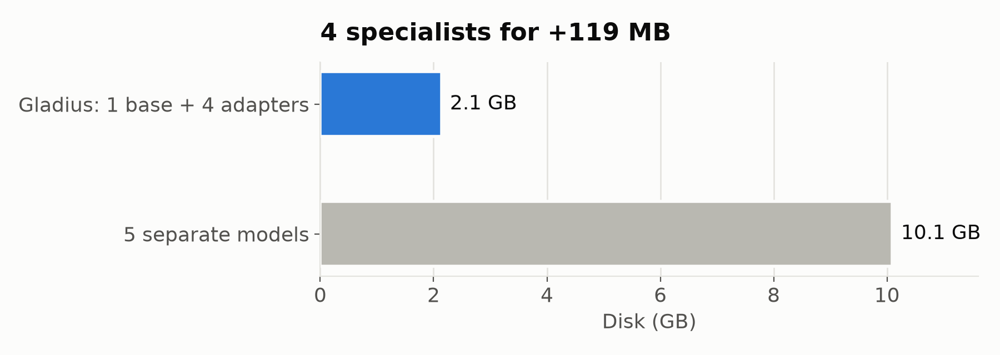
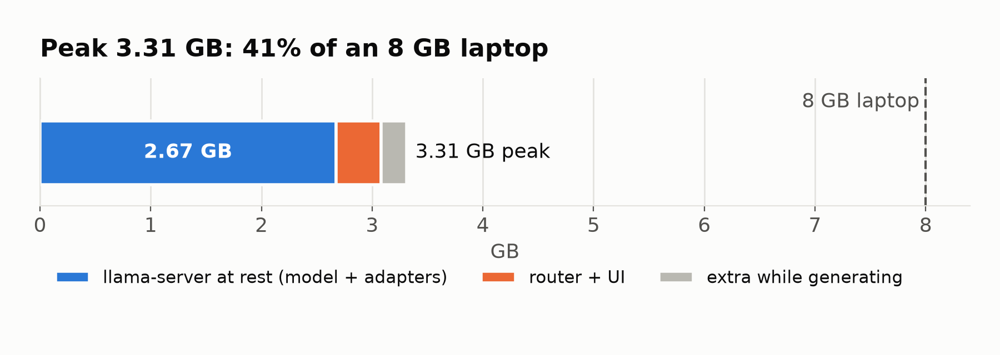
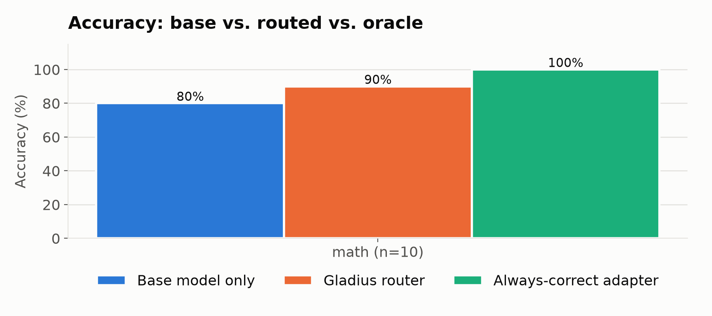
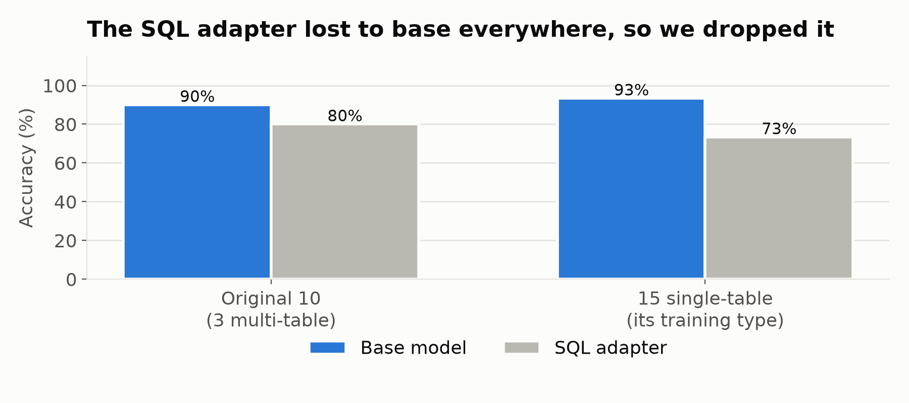

# Gladius

```text
            ▄▄▄
            ███▄▄▄▄▄▄▄▄▄▄▄▄▄▄▄▄▄▄▄▄▄▄▄▄▄▄▄▄▄▄▄▄▄▄
▄███▄▄▄▄▄▄▄▄█████████████████████████████████████████▄▄▄
█████▓▒▓▒▓▒▓███▒▒▒▒▒▒▒▒▒▒▒▒▒▒▒▒▒▒▒▒▒▒▒▒▒▒▒▒▒▒▒▒▒▒██████████━━╸
▀███▀▀▀▀▀▀▀▀█████████████████████████████████████████▀▀▀
            ███▀▀▀▀▀▀▀▀▀▀▀▀▀▀▀▀▀▀▀▀▀▀▀▀▀▀▀▀▀▀▀▀▀▀
            ▀▀▀

     ██████╗ ██╗      █████╗ ██████╗ ██╗██╗   ██╗███████╗
    ██╔════╝ ██║     ██╔══██╗██╔══██╗██║██║   ██║██╔════╝
    ██║  ███╗██║     ███████║██║  ██║██║██║   ██║███████╗
    ██║   ██║██║     ██╔══██║██║  ██║██║██║   ██║╚════██║
    ╚██████╔╝███████╗██║  ██║██████╔╝██║╚██████╔╝███████║
     ╚═════╝ ╚══════╝╚═╝  ╚═╝╚═════╝ ╚═╝ ╚═════╝ ╚══════╝

     ▓▒░  one model · four specialists · zero cloud  ░▒▓
```

Short, sharp, specialist AI on the laptop you already own. Fully local, fully offline, fully open source.

## Problem

Students can't afford API bills, and their 8 GB laptops can't run big models. Small local models (1–3B) fit in memory, but they're mediocre at everything.

## The idea

Run **one small base model plus a set of tiny skill adapters** (math, coding, technical writing, creative). For each prompt, a lightweight router picks the right specialist and switches it on. You get specialist-quality answers for roughly the memory cost of one model.

- **Four specialists, one model:** the adapters add about 119 MB to a 2 GB base model, instead of four more 2 GB models.
- **About 3.6 GB of RAM at peak** in the live app with notes on (45% of an 8 GB laptop), so it runs next to your browser. No GPU needed.
- **Your data stays local:** schedules, syllabi and grades are read from local files and never uploaded.
- **Every response is measured:** route, confidence, time, RAM and quality compared with the plain base model.

## Pipeline

```
prompt
  │
  ▼
Embed (Arctic Embed xs) ──► Semantic cache ── hit ──┐
  │ miss                                            │
  ▼                                                 │
Router: nearest centroid → route + confidence       │
  │◄────────────────────────────────────────────────┘
  ▼
Retriever: route-gated chunks from your local notes
  │
  ▼
Llama 3.2 3B (Q4) + chosen LoRA adapter → answer
  │
  ▼
UI: answer · route · confidence · cache · time · RAM
```

1. **Embed:** the prompt becomes one vector, which the cache, router and retriever all reuse.
2. **Cache:** if a near-identical prompt was seen before, the earlier routing decision is reused.
3. **Route:** cosine similarity against each skill's centroid (the average of about 20 example prompts). Low scores fall back to the base model.
4. **Retrieve:** routes that benefit pull matching chunks from `data/student/` (for example, syllabus deadlines for an email to a professor, or a schema for SQL).
5. **Generate:** every adapter is preloaded in `llama-server`, and each request turns one on, so switching adapters doesn't reload anything.

Details: [docs/pipeline.md](docs/pipeline.md) · Plan and benchmarks: [docs/plan.md](docs/plan.md)

## Quick start

Needs macOS or Linux, about 3 GB of free disk and 8 GB of RAM. No GPU or API keys.

```bash
git clone https://github.com/noahcilliers/hacktober-26.git && cd hacktober-26
```

**1. Install everything (once, ~10–20 min, ~2.5 GB of downloads):**

```bash
./setup.sh
```

This creates a Python environment in `.venv`, builds `llama-server` from llama.cpp, downloads the base model and the four LoRA adapters (converting them to GGUF), and caches the embedding model. It's safe to re-run: finished steps are skipped, so an interrupted install just picks up where it stopped. If Python 3.10–3.13 or the Xcode Command Line Tools are missing, it tells you what to install.

**2. Run Gladius:**

```bash
./run.sh
```

This starts `llama-server`, warms every adapter, and serves the UI at <http://localhost:8503>. Press `Ctrl+C` to stop the UI; the model server keeps running in the background so the next start is instant (stop it with `pkill llama-server`).

## Run from source

Use the pieces separately (activate the environment first with `source .venv/bin/activate`):

```bash
./serve.sh              # terminal 1: llama-server with base model + adapters
streamlit run retro.py  # terminal 2: chat UI
python bench.py         # writes results/results.json (~15 min)
python charts.py        # results/charts/*.png + results/summary.md
```

<details>
<summary>What <code>setup.sh</code> does, step by step</summary>

```bash
python3.11 -m venv .venv && source .venv/bin/activate
pip install -r requirements.txt

# llama.cpp: build llama-server (Metal on Apple Silicon), and get the LoRA converter
git clone https://github.com/ggml-org/llama.cpp vendor/llama.cpp
cmake -S vendor/llama.cpp -B vendor/llama.cpp/build -DCMAKE_BUILD_TYPE=Release -DLLAMA_CURL=OFF
cmake --build vendor/llama.cpp/build --target llama-server -j 8

# Base model (4-bit GGUF of meta-llama/Llama-3.2-3B-Instruct)
hf download bartowski/Llama-3.2-3B-Instruct-GGUF Llama-3.2-3B-Instruct-Q4_K_M.gguf --local-dir models

# Adapters: download PEFT weights, then convert each to GGUF
for p in math=SriSanthM/LLAMA-3.2-3B-MathInstruct_LORA_SFT \
         techwriter=Shankarblr/Llama-3.2-3B-TechWriter-LoRA creative=closestfriend/brie-llama-3b \
         coding=yusifnuri/Llama-3.2-3B-Instruct_code_generation; do
  hf download ${p#*=} adapter_config.json adapter_model.safetensors --local-dir adapters/${p%%=*}
  python vendor/llama.cpp/convert_lora_to_gguf.py adapters/${p%%=*} \
    --base-model-id unsloth/Llama-3.2-3B-Instruct --outtype f16 --outfile adapters/${p%%=*}.gguf
done
```

`setup.sh` pins llama.cpp to the commit we benchmarked. `--base-model-id unsloth/...` reads only the model config, from an ungated mirror, so you don't need a Hugging Face login.

</details>

### Prompt formats matter

Each adapter only helps when it gets the prompt format it was trained on. `engine.py` handles this per route:

| Route | Format | Effect |
|---|---|---|
| `sql` (dropped) | Raw `### Context / ### Question / ### SQL` with VARCHAR-typed schema, no chat template | 2/10 → 8/10, but still below base, so the adapter was dropped (see Results) |
| `math` | Plain question; asking for "a number on the last line" makes it write Python instead | 1/3 → 5/5 on the first eval questions |
| `coding` | HumanEval prefix: `Complete the following Python function:` | Code-only output |

## Results

Measured on an 8 GB M1 MacBook (`python bench.py`, `python eval_sql_adapter.py`, temperature 0, held-out prompts). Raw data is in `results/`.

| Metric | Value |
|---|---|
| Disk: base + 4 adapters | 2.14 GB (vs 10.1 GB as five separate models) |
| Adapters total | 119 MB |
| Peak RAM (server + router + UI) | 3.31 GB in the benchmark; about 3.6 GB in the live UI with notes on, since longer prompts grow the server's buffers |
| Routing accuracy | 94% held-out (n=35), 95% leave-one-out |
| Router latency | 16 ms mean, 26 ms p95; cache hit 2.6 ms |
| Adapter swap overhead | Under 50 ms, within run-to-run noise; no reload |
| Speed | 6–8 tok/s (measured under heavy memory pressure; faster with other apps closed) |
| Math accuracy (n=10) | base 80% · **router 90%** · always-correct adapter 100% |
| SQL adapter (dropped) | 73% vs base 93% on 15 single-table questions; 80% vs 90% on the original 10 |






**Honest notes:**

- The math adapter beats base. The router loses 10 points against the always-correct adapter, from one math question it sent to base.
- We tried a SQL adapter (`BY-ALF/llama-3.2-3b-sql-lora`) and dropped it. Even after matching its training prompt format, it lost to base on every question set, including the single-table questions it was trained for. SQL prompts are still detected, but the base model answers them. No other Llama 3.2 3B SQL adapter on Hugging Face was usable (too large, a full model, or a different base).
- The coding, techwriter and creative adapters don't have accuracy evals yet; they're judged on output style.
- Eval sets are small (10–15 per task), so treat these numbers as directional.

## Stack

| Layer | Choice |
|---|---|
| Base model | Llama 3.2 3B Instruct, GGUF Q4_K_M |
| Adapters | LoRA (GGUF): math, coding, techwriter, creative ([sources](docs/example_prompts.md)) |
| Inference | llama.cpp `llama-server` |
| Router + retrieval embeddings | Snowflake Arctic Embed xs via sentence-transformers |
| Vector math | NumPy (in memory, no vector DB) |
| UI | Streamlit |
| Metrics | psutil, `time.perf_counter` |

MIT License
